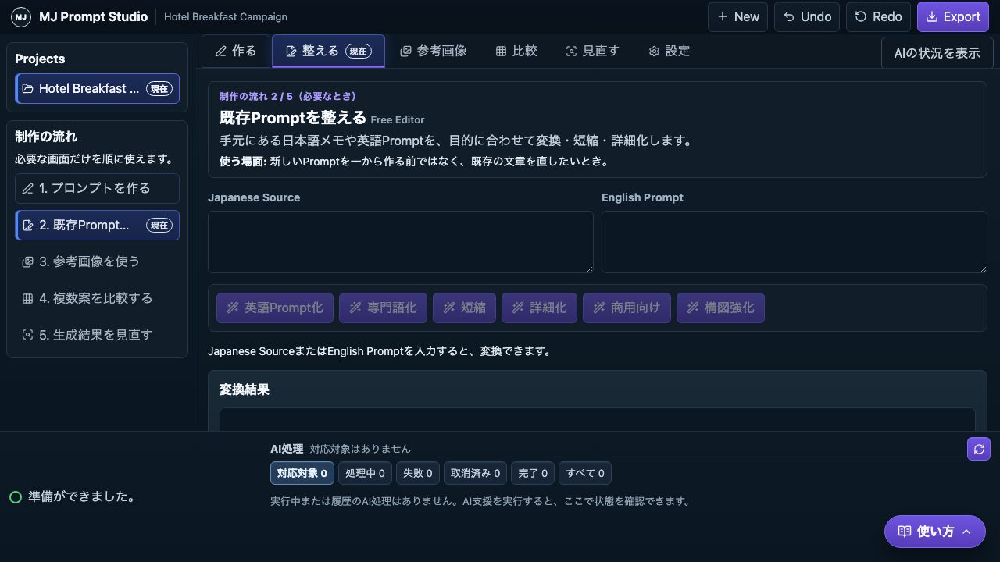
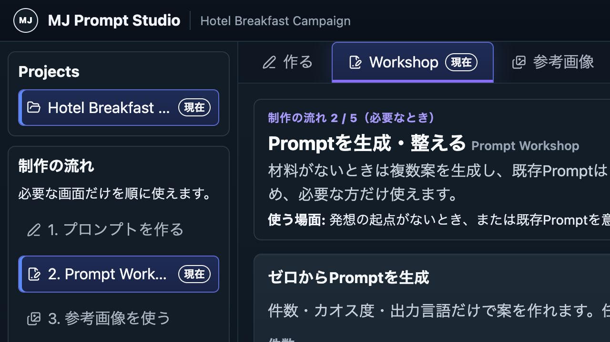
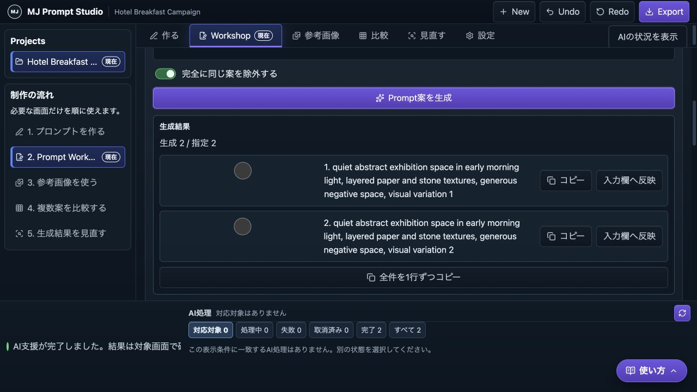
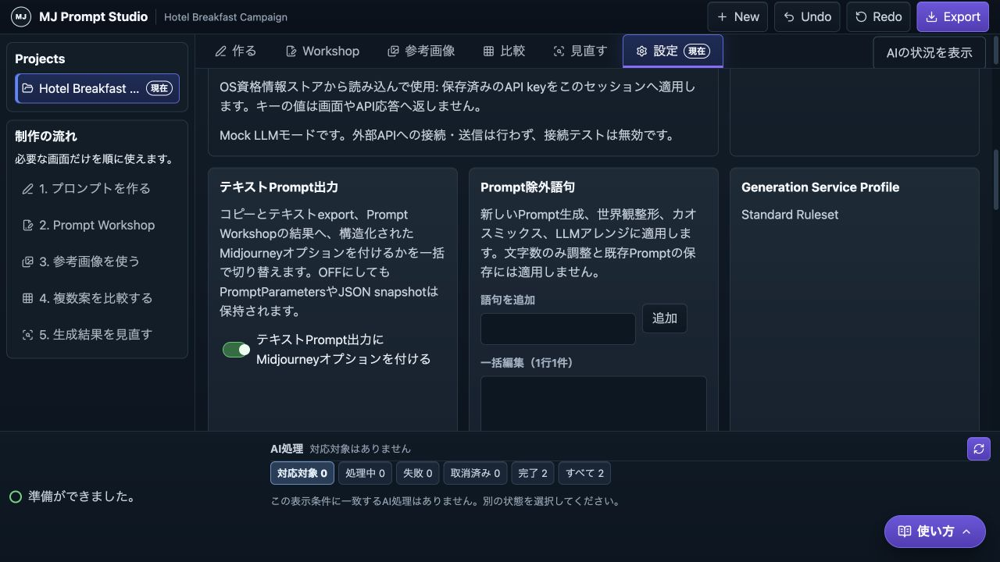

# Issue #54 Prompt Workshop UI/UXレビュー

## 概要

- 対象Issue / 子Issue / 作業: #54 / #55〜#60 / Prompt Workshop、共通テキスト出力設定、除外語句
- 画面・状態: Prompt Workshop、Settings、Generator、既存Prompt整形、文字数調整、presetアレンジ、空、queued/running、部分成功、失敗、狭幅、文字拡大
- 判定: PASS（Ready PR、CI、review thread確認待ち）
- P0 / P1 / P2件数: 0 / 0 / 0

## ユーザー価値

- 入力材料がない利用者は、件数・カオス・言語だけを指定してPrompt案を得られる。既存Promptがある利用者は、世界観、カオス、文字数、プリセットを目的別に選んで再構成できる。
- 主要操作は画面に残したbuttonと短い説明で発見でき、生成結果はコピーまたは入力欄へ戻せる。LLM設定・API key・画像生成サービスへの自動送信はUIに追加しない。
- テキスト出力の既知オプションと除外語句はSettingsへ集約し、既存のComposer、Matrix、Result Review候補を含む出力経路で同じpolicyを使う。

## state matrix

| 状態 | 見えるもの・操作 | 回復 | a11y・証跡 | 判定 |
|---|---|---|---|---|
| 初期 / 入力なし | 生成件数、カオス、言語、任意ガイダンス、`Prompt案を生成` | 既定値のまま生成できる | native input/select、visible label、空状態E2E・screenshot | PASS |
| 既存Promptなしの整形 | source必須の操作はdisabledまたは理由を表示 | sourceを入力して再実行 | disabled理由と説明の関連付け | PASS |
| queued / running | 操作単位の待機表示と重複実行防止 | 完了後に結果操作へ戻る | `aria-live`のstatus、Job E2E | PASS |
| 複数 / 部分成功 | 各結果のcopy / input操作、成功件数 | 個別結果を使うか再実行 | 結果見出し、status、Mock/E2E | PASS |
| schema・除外語句違反 | 失敗理由を表示し、隠れた再試行をしない | 入力・設定を修正して明示的に再実行 | API・unit contract test | PASS |
| 長文 / 文字数制限 | 長さ倍率と上限を選択 | 1回だけrepairし、上限でも結果を除外しない | code point検証unit test | PASS |
| Settings | 出力オプションtoggle、除外語句の追加・一括追加・削除・全削除確認 | 明示保存と確認dialogで戻れる | label、confirm、保存復元test | PASS |
| 狭幅 / 文字拡大 | 操作labelを保持して縦に再配置 | 横scrollなしで操作継続 | 760px・125%相当E2E | PASS |

## 品質確認

- accessibility: 主要actionにvisible labelを残し、native control、disabled状態、説明文、結果statusを使う。結果操作はkeyboardでも到達でき、既存のfocus styleを維持する。
- 視覚階層とcopy: 「Prompt案を生成」を先頭の主actionに置き、既存Prompt向け操作は目的別cardに分離した。UIに特定のMidjourneyバージョン、LLMモデル名、誤認を招くサービス状態を表示しない。
- 効率と信頼: 生成は0件を許さず最大30件、アレンジは45件の組み込みpresetを分類して選べる。結果を入力欄へ戻す導線を維持し、生成本文・除外語句・任意ガイダンスはログ、snapshot、公開証跡へ保存しない。
- 反証レビュー: 保存済みの終端Jobを初回ロード時に再通知する回帰を修正した。LLM feature設定に存在しない新操作を表示するno-op設定も除去し、固定実行policyの設定面を増やさない。

## 証跡・検証

- screenshotは隔離Mock環境と架空の短いfixtureだけで撮影した。API key、実ユーザーPrompt、画像、ローカルpath、request/job/trace IDがないことを目視し、画像metadataも確認した。
- `make lint`、`make typecheck`、`make test`（63 passed）、`make build`、`make client-lint`、`make client-typecheck`、`make client-test`（15 files / 49 tests）、`make client-build`、`make generate-openapi`、`git diff --check`、`make package`、`make verify-governance`がPASS。
- 隔離Mock環境で`make e2e`（22 tests）を実行し、Prompt Workshopの生成・整形・結果操作と既存画面のnavigation、狭幅、文字拡大を確認した。
- 45 presetは移行元の識別子・順序と比較し、同数であることを確認した。package検証でJSON resourceがwheel/tarに含まれることも確認した。
- 未実施: 実OpenAI APIの品質、レイテンシ、消費量。実APIはユーザーの明示的opt-inが必要で、通常テストとCIではMockLLMを使用する。
